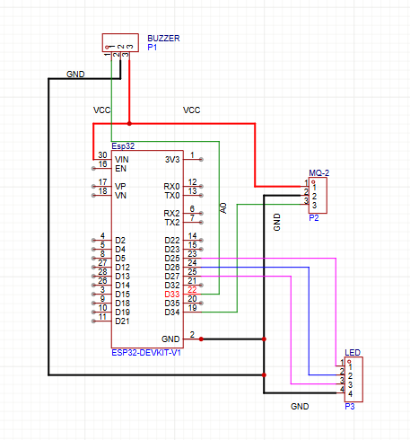

# 🔥 SmokeBot — ESP32 Gas & Smoke Detection
ระบบตรวจจับแก๊สและควันด้วย ESP32 แจ้งเตือนผ่าน Telegram Bot

## Features
- 🔄 Self-calibration อัตโนมัติ 5-15 นาที
- 📊 Auto-recalibration ทุก 1 ชั่วโมง
- 🚨 แจ้งเตือน Telegram แบบ Real-time
- 🔇 Remote mute/unmute ผ่าน Bot
- 🛠️ Custom PCB ออกแบบและผลิตเอง

## Hardware
- ESP32 DevKit V1
- MQ-2 Gas Sensor
- LED x3 (Green/Red/Yellow)
- Active Buzzer

## Commands
| Command | Description |
|---------|-------------|
| /status | ดูค่าแก๊สปัจจุบัน |
| /mute | ปิดเสียง Buzzer |
| /unmute | เปิดเสียง Buzzer |
| /recalibrate | ปรับค่าเซนเซอร์ใหม่ |
| /resetwifi | รีเซ็ต Wi-Fi |
| /help | ดูคำสั่งทั้งหมด |

## PCB
ออกแบบด้วย EasyEDA และผลิตด้วยวิธี Toner Transfer + Ferric Chloride Etching

## Photos




## Setup
1. Clone repository
2. แก้ไข credentials ใน SmokeBotGit.ino
```cpp
const char* ssid     = "YOUR_WIFI_SSID";
const char* password = "YOUR_WIFI_PASSWORD";
#define BOTtoken "YOUR_BOT_TOKEN"
#define CHAT_ID  "YOUR_CHAT_ID"
```
3. Upload ด้วย Arduino IDE
4. รอ Calibration 5-15 นาที

## Dependencies
- UniversalTelegramBot
- WiFiManager
- ArduinoJson
